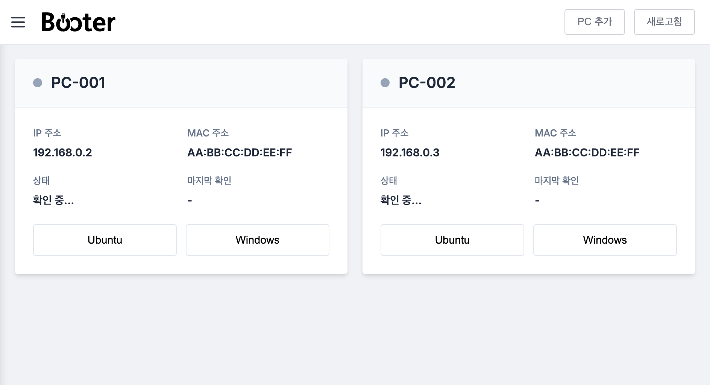

[](https://github.com/hololee/booter/actions/workflows/ci.yml)
[](https://github.com/hololee/booter/actions/workflows/ci.yml)

# Booter

FastAPI-based web service for controlling multiple dual-boot PCs remotely using Wake-on-LAN.



## 기능

- **Multi-PC Support**: 여러 PC를 단일 웹 인터페이스에서 관리
- **Wake-on-LAN**: 원격으로 PC 부팅
- **Dual-boot Control**: Ubuntu 또는 Windows로 부팅 선택
- **Real-time Status**: WebSocket을 통한 실시간 상태 업데이트
- **Responsive UI**: PC와 모바일에서 모두 사용 가능

## Docker로 실행 (권장)

```bash
# 실행
docker-compose up -d
```

## 사용법

1. 웹 인터페이스에서 "PC 추가" 버튼 클릭
2. PC 정보 입력 (이름, MAC 주소, IP 주소, SSH 설정 등)
3. Ubuntu 부팅 또는 Windows 부팅 버튼으로 PC 제어
4. 실시간으로 PC 상태 확인
